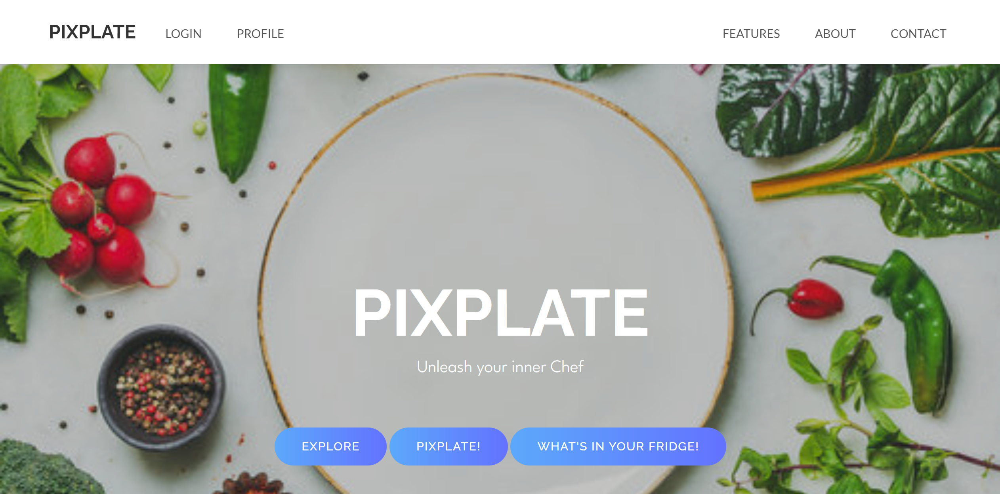
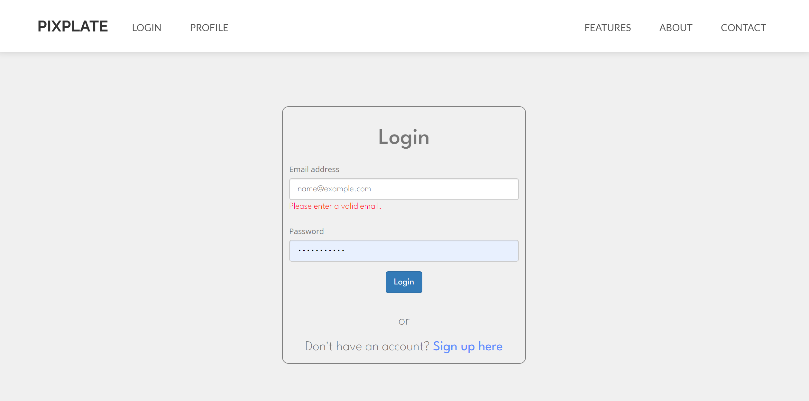

# welcome to PixPlate - Your favourite recipe recommender
---

## PixPlate - Instruction Journal

### Installing the Dependencies

Follow the steps below to set up the project on your local machine.

#### 1. Install Server-side Packages

Run the following command in the root of the project to install the necessary packages:

```sh
npm install
```

#### 2. Run the React App

Navigate to the frontend directory and start the React application:

```sh
cd frontend
npm start
```

#### 3. Run the Backend Server

Use nodemon to start the backend server:

```sh
nodemon app
```
---

### App Demo
This App demo will help users traverse the app. 
#### Main Page



#### Login Page
Users will have to login or create an account before trying to access "PIXPLATE" and "WHAT'S IN YOUR PLATE" features.  



#### WHAT'S IN YOUR FRIDGE:
Users can upload pictures of their fridge and get recipe recommendations based on the items discovered in the fridge. Users can also provide additional information on their health conditions, cuisine etc.. to get much better recipe recommendations. Users can like the recipes and it will be further added into the liked recipes section of their profile. 

[PIXFRIDGE Page](frontend/public/img/demo/PixFridge_demo.jpg)

Here's the video demo:

.gif)

#### PIXPLATE:
A fun place where users can select ingredients and click generate to get personalized recipes. Users can like the recipes and it will be further added into the liked recipes section of their profile. 

Here's the video demo:

.gif)


